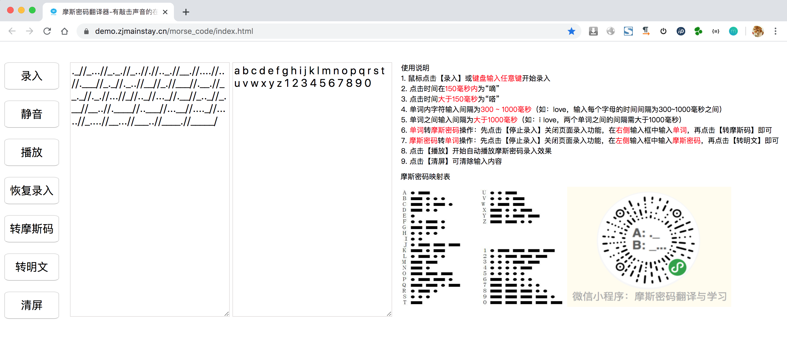

# 摩斯密码翻译器

微信小程序「摩斯密码翻译与学习」网页版，摩斯密码翻译器-有敲击声音的在线摩斯密码翻译练习工具。

借鉴自：https://github.com/moutend/RxMorse

转载引用请注明项目来源于：https://github.com/Zjmainstay/morse_code

工具地址：https://demo.zjmainstay.cn/morse_code/

界面截图：

微信小程序版本录屏效果：

<video src="./wechat-morse-code.mp4"></video>

